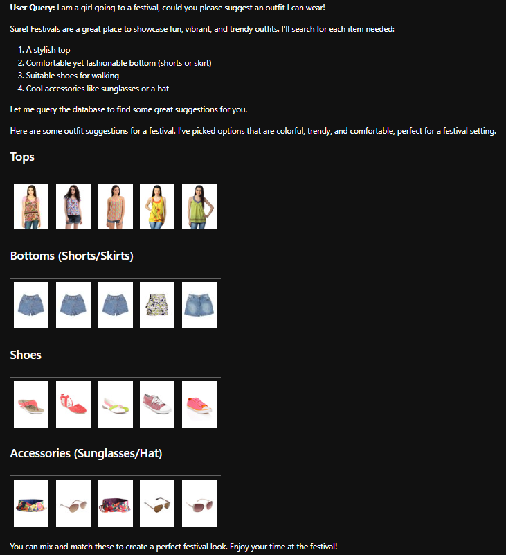

# Fashion AI Chat Bot

The aim of this project is to develop a bot that recommends fashion items based on user requests. To achieve this, we will use the following technologies:

- **SQL Queries**: To categorize items
- **PIL (Python Imaging Library)**: For converting images into vector embeddings
- **HNSWlib**: Hierarchical Navigable Small World library for vector querying of images
- **Chat GPT API tools**: Allowing users to interact with an AI bot for questions and suggestions

This combined approach of low-fidelity (Low-fi) and high-fidelity (High-fi) methods will provide a robust query system for users.

### Data

We have downloaded a training dataset from [Kaggle](https://www.kaggle.com/datasets/paramaggarwal/fashion-product-images-small?select=images). This dataset includes numerous images, each tagged with additional information in a CSV file. The CSV dataset is structured as follows:

- id
- gender
- masterCategory
- subCategory
- articleType
- baseColour
- season
- usage

Each image will be processed into embeddings so that they can be queried using descriptive words.

### Vectorisation Approach

The data is first parsed and then saved into a SQL database using SQLAlchemy. Following this, we create embeddings for the images using PIL. Each embedding is a 512-dimensional vector that accurately summarizes the image.

This process involves multiple layers, where the top layer represents the vectors but has a limited number of entry points. HNSW (Hierarchical Navigable Small World) is an algorithm designed for efficient approximate nearest neighbor search, organizing data into a multi-layer graph for fast and accurate search operations.


### How It Works
1. **Multi-Layer Graph**:
   - **Layers**: The graph is divided into multiple layers.
   - **Top Layers**: Sparse with long-range connections for broad searches.
   - **Bottom Layers**: Dense with short-range connections for detailed searches.

2. **Building the Graph**:
   - **Insertion**: Each new point is inserted into multiple layers, connecting to a few nearest neighbors.
   - **Connections**: Points in higher layers have fewer, longer connections, while points in lower layers have more, shorter connections.

3. **Searching**:
   - **Start at the Top**: Begin search at the topmost layer.
   - **Navigate Down**: Move through layers, refining the search at each level.
   - **Find Nearest Neighbors**: The final search is conducted in the dense bottom layer for high accuracy.

### Why HNSW is Better Than Normal KNN
1. **Speed**:
   - **HNSW**: Logarithmic search time \(O(\log N)\) due to hierarchical structure.
   - **KNN**: Linear search time \(O(Nd)\) due to brute-force distance computations.

2. **Efficiency**:
   - **HNSW**: Fewer distance computations by focusing on promising regions.
   - **KNN**: Computes distance to every point, leading to inefficiency.

3. **Memory Usage**:
   - **HNSW**: Efficiently manages memory by organizing data into layers.
   - **KNN**: High memory usage as all data must be loaded and processed.

4. **Scalability**:
   - **HNSW**: Scales well with large datasets and high-dimensional data.
   - **KNN**: Becomes impractical for large datasets due to computational and memory constraints.

HNSW offers significant improvements over normal KNN by leveraging a hierarchical multi-layer graph, enabling fast, efficient, and scalable nearest neighbor searches.

This approach to parsing the images allows for extremely quick retrieval:

```python
images_folder = os.path.join("../", "data", "raw", "images")
metadata_file = os.path.join("../", "data", "raw", "styles.csv")
embeddings_file = os.path.join("..", "data", "processed", "embeddings.npy")
image_ids_file = os.path.join("..", "data", "processed", "image_ids.npy")

# Function to Generate Embedding for an Image
def generate_embedding(image_path):
    try:
        image = PILImage.open(image_path).convert("RGB")
        image = preprocess(image).unsqueeze(0).to(device)
        with torch.no_grad():
            embedding = model.encode_image(image).cpu().numpy().flatten()
        # Normalize the embedding
        embedding = embedding / np.linalg.norm(embedding)
        return embedding
    except Exception as e:
        print(f"Error generating embedding for {image_path}: {e}")
        return None
```
These embeddings are the saved on a local machine rather than in a database. 

Then we want to query these embeddings:

```python
def generate_text_embedding(text, model, device):
    text_input = clip.tokenize([text]).to(device)
    with torch.no_grad():
        text_embedding = model.encode_text(text_input).cpu().numpy().flatten()
    # Normalize the embedding
    text_embedding = text_embedding / np.linalg.norm(text_embedding)
    return text_embedding
    
def search_similar_images(index, query_embedding, image_ids, top_k=5):
    labels, distances = index.knn_query(query_embedding, k=top_k)
    similar_image_ids = [image_ids[i] for i in labels[0]]
    return similar_image_ids

```

When we query the HNSWLib layer structure, the algorithm performs a rapid KNN to return the embeddings that most accurately describe our description. For example, querying for __yellow shoes__ produces the following result:


### GPT Integration Approach

Now that we have a system that can parse through a database and retrieve images, we need to integrate a GPT model to allow users to ask questions.

For an in-depth solution to asking questions to a database, see this [repository](https://github.com/jotren/GPT-Database-Integration). Essentially, we need to use recursion, tool calls, and GPT-4o to achieve this. The core function is as follows:

```python
def run_conversation(user_query, introduction, top_k, max_depth, session_messages=None):
    print(max_depth)
    if session_messages is None:
        session_messages = []

    if not session_messages:
        session_messages.append({"role": "system", "content": introduction})

    tools = define_tools()

    all_image_paths_dict = {}
    all_responses = []

    session_messages.append({"role": "user", "content": user_query})
    depth = 0

    while depth < max_depth:
        response = client.chat.completions.create(
            model="gpt-4o",
            messages=session_messages,
            tools=tools,
            tool_choice="auto"
        )

        response_content = response.choices[0].message.content

        print(response)
        
        if response_content:
            all_responses.append(response_content)
            session_messages.append({"role": "assistant", "content": response_content})

        finish_reason = response.choices[0].finish_reason
        if finish_reason == "stop":
            break
        elif finish_reason == "tool_calls":
            tool_calls = response.choices[0].message.tool_calls
            for tool_call in tool_calls:
                function_name = tool_call.function.name
                function_args = json.loads(tool_call.function.arguments) if tool_call.function.arguments else {}
                print('functions')
                print(function_name)
                print(function_args)
                function_response = handle_function_call(function_name, function_args, top_k)
                session_messages.append({"role": "system", "name": function_name, "content": json.dumps(function_response)})

                if function_response:
                    session_messages.append({"role": "system", "name": function_name, "content": json.dumps(function_response)})

                    if function_name == "query_database":
                        for item_name, paths in function_response.items():
                            if item_name not in all_image_paths_dict:
                                all_image_paths_dict[item_name] = []
                            all_image_paths_dict[item_name].extend(paths)
            
                
            depth += 1
        else:
            print(f'Unhandled finish reason: {finish_reason}')
            break

    return all_responses, session_messages, all_image_paths_dict

```


### Furter Improvements

I would like the system to be able to filter by

- Brand
- Season
- Year

This would allow the user to tailor requests better.

### Key Learnings

- __GPT-4o__: The normal GPT cannot return an array of functions with which to call. In our case, we need to parse the database for multiple items of clothing, which requires a number of calls to the database.
- __HNSW__: Faster and more robust than FAISS or Scann. FAISS didn't support GPU acceleration on a Windows machine, and Scann was very hard to compile and deploy.
- __Low-Resolution Images__: Can still provide meaningful output. If pushed to production, compression of images would be key. You would probably just save a URL to the image with embeddings, but during processing, low resolution might save you with respect to processing power.


