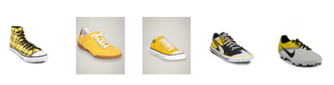

# Fashion AI Chat Bot

Aim of this project is to make a bot that can reccomend fashion items based on a request. To achieve this I will be using: 

- SQL Queries: To categorise items
- PIL OpenAI: For the conversion of images into vector embeddings
- HNSWlib : Hierarchical Navigable Small World library for vector querying of images
- Chat GPT API tools: Allow the user to interact with an AI bot, this way the user is able to ask questions and get suggestions.

This combined approach of Low-fi and High-fi I think will provide a robust query system for the user.

### Data

Have downloaded a file with training data from [here](https://www.kaggle.com/datasets/paramaggarwal/fashion-product-images-small?select=images). This dataset has a number of images, with some additional tags for each image id in a csv. Here is how the csv dataset is structured:

- id
- gender
- masterCategory
- subCategory
- articleType
- baseColour
- season
- usage

Each image will be processed for embeddings so that the images can be queried with words.

### Vectorisation Approach

The data was first parsed and then saved into a SQL database using SQLalchemy. Following this we created the embeddings for the images using PIl. This is a 512 dimensional vector that can accurately summarise the image.

This works by having a number of layers, the top layer is a representation of the vectors, but only has a limited number of entry points. HNSW (Hierarchical Navigable Small World) is an algorithm designed for efficient approximate nearest neighbor search. It organizes data into a multi-layer graph to enable fast and accurate search operations.


### How It Works
1. **Multi-Layer Graph**:
   - **Layers**: The graph is divided into multiple layers.
   - **Top Layers**: Sparse with long-range connections for broad searches.
   - **Bottom Layers**: Dense with short-range connections for detailed searches.

2. **Building the Graph**:
   - **Insertion**: Each new point is inserted into multiple layers, connecting to a few nearest neighbors.
   - **Connections**: Points in higher layers have fewer, longer connections, while points in lower layers have more, shorter connections.

3. **Searching**:
   - **Start at the Top**: Begin search at the topmost layer.
   - **Navigate Down**: Move through layers, refining the search at each level.
   - **Find Nearest Neighbors**: The final search is conducted in the dense bottom layer for high accuracy.

### Why HNSW is Better Than Normal KNN
1. **Speed**:
   - **HNSW**: Logarithmic search time \(O(\log N)\) due to hierarchical structure.
   - **KNN**: Linear search time \(O(Nd)\) due to brute-force distance computations.

2. **Efficiency**:
   - **HNSW**: Fewer distance computations by focusing on promising regions.
   - **KNN**: Computes distance to every point, leading to inefficiency.

3. **Memory Usage**:
   - **HNSW**: Efficiently manages memory by organizing data into layers.
   - **KNN**: High memory usage as all data must be loaded and processed.

4. **Scalability**:
   - **HNSW**: Scales well with large datasets and high-dimensional data.
   - **KNN**: Becomes impractical for large datasets due to computational and memory constraints.

HNSW offers significant improvements over normal KNN by leveraging a hierarchical multi-layer graph, enabling fast, efficient, and scalable nearest neighbor searches.

This approach to parsing the images allows for extremely quick retrieval:

```python
images_folder = os.path.join("../", "data", "raw", "images")
metadata_file = os.path.join("../", "data", "raw", "styles.csv")
embeddings_file = os.path.join("..", "data", "processed", "embeddings.npy")
image_ids_file = os.path.join("..", "data", "processed", "image_ids.npy")

# Function to Generate Embedding for an Image
def generate_embedding(image_path):
    try:
        image = PILImage.open(image_path).convert("RGB")
        image = preprocess(image).unsqueeze(0).to(device)
        with torch.no_grad():
            embedding = model.encode_image(image).cpu().numpy().flatten()
        # Normalize the embedding
        embedding = embedding / np.linalg.norm(embedding)
        return embedding
    except Exception as e:
        print(f"Error generating embedding for {image_path}: {e}")
        return None

# Collect Embeddings and Metadata
embeddings = []
image_ids = []
faiss_index = 0

# Wrap the loop with tqdm for progress tracking
for idx, row in tqdm(metadata.iterrows(), total=metadata.shape[0], desc="Processing images"):
    image_path = os.path.join(images_folder, str(row['id'])+".jpg")
    image_path = os.path.normpath(image_path)  # Normalize the path to ensure consistency
    if os.path.exists(image_path):
        embedding = generate_embedding(image_path)
        if embedding is not None:
            embeddings.append(embedding)
            image_ids.append(row['id'])

# Convert Embeddings to Numpy Array and Save to Disk
embeddings = np.vstack(embeddings).astype('float32')
np.save(embeddings_file, embeddings)
np.save(image_ids_file, image_ids)

```
These embeddings are the saved on a local machine rather than in a database. 

Then we want to query these embeddings:

```python
def generate_text_embedding(text, model, device):
    text_input = clip.tokenize([text]).to(device)
    with torch.no_grad():
        text_embedding = model.encode_text(text_input).cpu().numpy().flatten()
    # Normalize the embedding
    text_embedding = text_embedding / np.linalg.norm(text_embedding)
    return text_embedding
    
def search_similar_images(index, query_embedding, image_ids, top_k=5):
    labels, distances = index.knn_query(query_embedding, k=top_k)
    similar_image_ids = [image_ids[i] for i in labels[0]]
    return similar_image_ids

def display_images(image_ids, image_folder_path, max_images=5):
    for i, image_id in enumerate(image_ids):
        if i >= max_images:
            break
        image_path = os.path.join(image_folder_path, f"{image_id}.jpg")
        if os.path.exists(image_path):
            img = Image.open(image_path)
            display(img)
        else:
            print(f"Image {image_id} not found")

# Function to query and display similar images
def query_and_display_images(query_text, top_k=5, display=False):
    query_embedding = generate_text_embedding(query_text, model, device)
    query_embedding = query_embedding / np.linalg.norm(query_embedding)
    similar_image_ids = search_similar_images(hnsw_index, query_embedding, image_ids, top_k)
    if display:
        display_images(similar_image_ids, image_folder_path)
    return similar_image_ids

# Example usage in Jupyter Notebook
query_text = "yellow shoes"
monitor_resources()  # Monitor resources before the query
similar_image_ids = query_and_display_images(query_text, top_k=5, display=True)
monitor_resources()  # Monitor resources after the query
print(similar_image_ids)

```

When we query the HNSWLib layer structure, the algorithmn will perform a rapid KNN to return the embeddings that most accurately describe our description. In the case of __yellow shoes__ this was the result: 



### GPT Integration Approach

Now that we have a system that can 
